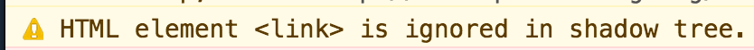
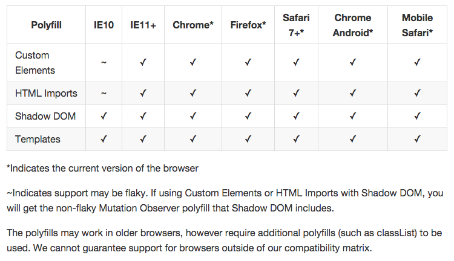

name: lblue
layout: true

class: bg-light, center, middle

---

class: title

# Why you should be using Web Components Now. And How.

* <span class="speaker">Phil @leggetter</span>
* <span class="speaker-job-title">Head of Developer Relations</span>
* <span class="speaker-pusher-logo"></span>

???

---

class: bg-dark bg-contain circles
background-image: url(./img/pusher-circles.png)

---

class: bg-cover
background-image: url(./img/brjs-video-compilation.png)

---

# What we'll cover

* What are Web Components?
* The State of Web Components
* Componentised Web Apps Now
* Why Web Components are the Future!

???

* As advertised...

---

class: trans-h top
background-image: url(./img/beuller.gif)

# What are Web Components?

---

# What are Web Components?

* Custom Elements
* HTML Templates
* Shadow DOM
* HTML Imports


???

* But, before we start let's look at what we've got right now

---

class: bg-dark

# Custom Elements

---

class: wide, long

## Elements - Structure & Meaning

```xml
<!doctype html>
<html>
	<head>
		<meta charset="utf-8" />
		<title>HTML Elements</title>
		<meta name="description" content="" />
		<link rel="stylesheet" href="css/stylez.css" />
	</head>
	<body>
		<nav>
			<ul>
				<li><a href="#">Home</a></li>
			</ul>
		</nav>
		<header>
			<p>Hello world! This (part of) is HTML5 Boilerplate.</p>
		</header>
		<main>
			<article>Ohhhh. Interesting</article>
		</main>
		<footer>&copy; me</footer>
		<script src="js/script.js"></script>
	</body>
</html>
```

<small><a href="https://developer.mozilla.org/en/docs/Web/Guide/HTML/HTML5/HTML5_element_list">MDN HTML5 Elements list</a></small>

???
* Some elements are visual
* Others aren't
* We can derive some meaning from this markup

---

background-image: url(img/gmail.png)
class: center, middle, trans-h

## Elements in "apps"

???

* If only all apps markup looked like this

---

background-image: url(img/gmail-elements.png)
class: trans-h

## Elements. Arrrgghhh!

???

* Building larger apps the semantic nature of the markup goes out the window

---

class: top

## &lt;Custom Elements /&gt;
--

* Bring semantic markup back
* More than just markup
* IMHO the most important part of Web Components

???

* Not the only reason for custom elements
* But a nice way of providing an introduction - via a use case

---

class: code-reveal, top, long, wide

## Custom Elements: A new Gmail

```xml
<!doctype html>
<html>
	<head>
		<meta charset="utf-8">
		<title>A new Gmail?</title>
		<meta name="description" content="">
	</head>
	<body>
```

--

```xml
		<header>
			
			<gmail-search />
			<gmail-account-strip />
		</header>
```

--

```xml
		<gmail-side-bar>
			<nav is="gmail-labels"></nav>
			<gmail-contacts />
		</gmail-sidebar>
```

--

```xml
		<main>
			<nav is="gmail-categories"></nav>
			<gmail-email-list />
		</main>
```

--

```xml
		<hangouts />
	</body>
</html>
```

---

class: bg-contain top trans-h
background-image: url(./img/all-components.png)

## [Tools, Tips & Tricks for building Componentised Web Apps](http://leggetter.github.io/componentised-web-apps/#1)

---

class: wide

## Start Simple - An Avatar

.left-code-col[
```xml

```
]

.right-example-col[

]

.left-code-col[
```xml

```
]

.right-example-col[

]

.left-code-col[
```xml

```
]

.right-example-col[

]

.left-code-col[
```xml

```
]

.right-example-col[

]

---

class: code-reveal, top, wide

## Custom Elements

```xml
<my-avatar service="twitter" username="leggetter" />
```

--

```xml
<script>
var MyAvatarPrototype = Object.create(HTMLElement.prototype);
```

--

```js
MyAvatarPrototype.createdCallback = function() {
	var username = this.getAttribute('username');
	var service = this.getAttribute('service');
```

--

```js
	var url = 'http://avatars.io/' + service + '/' + username;
```

--

```js
	var img = document.createElement( 'img' );
	img.setAttribute('src', url);
	this.appendChild(img);
};

```

--

```js
document.registerElement('my-avatar', {
	prototype: MyAvatarPrototype
});
</script>
```

.footer[
Define your own elements.
]

???

* Note: `my-` prefix

---

class: wide

## `<my-avatar />`

.left-code-col[
```xml
<my-avatar service="twitter" username="leggetter" />
```
]

.right-example-col[
<my-avatar service="twitter" username="leggetter" />
]

.left-code-col[
```xml
<my-avatar service="instagram" username="leggetter" />
```
]

.right-example-col[
<my-avatar service="instagram" username="leggetter" />
]

.left-code-col[
```xml
<my-avatar service="twitter" username="hackferencebrum" />
```
]

.right-example-col[
<my-avatar service="twitter" username="hackferencebrum" />
]

---

class: code-reveal, wide, top

## Custom Elements - Extending

```xml

```

--

```js
<script>
var MyAvatarExtPrototype = Object.create(HTMLImageElement.prototype);
```

--

```js
MyAvatarExtPrototype.createdCallback = function() {
	var username = this.getAttribute('username'),
	service = this.getAttribute('service'),
	url = 'http://avatars.io/' + service + '/' + username;

	this.setAttribute('src', url);
};
```

--

```js
document.registerElement('my-avatar-ext', {
	prototype: MyAvatarExtPrototype,
	extends: 'img'
});
</script>
```

.footer[
Extending existing elements
]

---

## Custom Elements - Lifecycle

* `createdCallback`
* `attachedCallback`
* `detachedCallback`
* `attributeChangedCallback(attrName, oldVal, newVal)`


???

* Demo changing service on the two elements

---

## Create Elements using JavaScript

<div id="phils"></div>

```xml
<script>
function createPhils() {
	var tooManyPhils = 104;
	var phils = 0;
	do {
		var el = document.createElement( 'my-avatar' );
		el.setAttribute('service', 'twitter');
		el.setAttribute('username', 'leggetter');
		document.getElementById( 'phils' ).appendChild( el );
		++phils;
	} while( phils < tooManyPhils );
}
</script>
```

<button data-action="createPhils">Create Phils</button>

---

background-image: url(img/why-custom-elements.png)
class: bg-contain, trans-h

## Why Custom Elements?

???

* mutation observers - observe changes in the DOM in various ways
* declarative and readable
* common way to extend
* reusable
* ... and - what's in the slide

---

class: bg-dark

# Templates

## Native HTML Templating Support

???

* The HTML markup version of jQuery
* We needed it so it's become a browser standard

---

background-image: url(img/template-chooser.png)

```xml
<script type="text/x-handlebars-template">
	<div class="entry">
		<h1>{{title}}</h1>
		<div>{{body}}</div>
	</div>
</script>
```

???

* Examples of templating solutions.
* Why we need a native solution
	* Hacky
	* The majority push around strings
	* XSS vulnerable
---

class: code-reveal, container, wide, top, long

## HTML Templates <button data-action="createAvatar">Create Avatar</button>

```xml
<template id="my-avatar-template">
	<style>
		.container { background-color: gold; }
		<!-- omitted for brevity -->
	</style>
	<div class="container">
		
		<span class="username"></span>
		<span class="service"></span>
	</div>
</template>
```

--

```js
var MyAvatarTmplPrototype = Object.create(HTMLElement.prototype);

MyAvatarTmplPrototype.createdCallback = function() {
	// get attributes & build url
```

--

```js
	var content = document.querySelector( '#my-avatar-template' ).content;
	var el = document.importNode( content, true );
```

--

```js
	el.querySelector( '.avatar' ).setAttribute( 'src', url );
	el.querySelector( '.username' ).textContent = username;
	el.querySelector( '.service' ).textContent = service;
	this.appendChild( el );
};
```

--

```js
document.registerElement('my-avatar-tmpl', {
	prototype: MyAvatarTmplPrototype
});
```

---

class: middle, center

## Why native HTML Templates?

* Libraries → Native
* Native benefits
* Document fragment = lightweight
* Inert until cloned/used

???

* use DOM to scaffold DOM → no XSS
* parsed, not rendered
* content is inert until cloned/used
* doc fragment → not part of the page

---

class: bg-dark

# Shadow DOM
## DOM/CSS "scoping" / protection

---

## Shadow DOM - Already using it

<video preload="metadata" autoplay muted loop style="height: 200px;">
	<source src="assets/dizzy.mp4" type="video/mp4">
	<source src="assets/dizzy.webm" type="video/webm">
	<source src="assets/dizzy.ogv" type="video/ogg">
</video>

???

* Chrome Options
* Show User Agent Shadow DOM

---

class: top

## Shadow DOM - Problems it solves

--

class: wide

.left-code-col[
```xml
Styles <span class="container">Bleed!</span>
```

```xml
<template id="my-avatar-tmpl">
	<style>
		.container { background-color: cyan; }
		...
```

```xml
<my-avatar-tmpl service="twitter" username="leggetter" />
```
]

.right-example-col[
Styles <span class="container">Bleed!</span>
<button data-action="createBleed">Create</button>
]

--

.left-code-col[
```xml
<template id="my-avatar-template">
	<div class="container">
		
		...
</template>
```
]

.right-example-col[
Global DOM <br /> e.g. `id` attributes
]

???

* bleed -> styles from the page bleed in or styles from the element out

---

class: code-reveal, container, wide, top, long

## Shadow DOM - In Action <button data-action="createhackferencebrum">Create hackferencebrum</button>

--

```xml
<template id="my-avatar-shadow-tmpl">
	<style>
		.container { background-color: red; color: white; }
		...
	</style>
	<div class="container">
		
		...
	</div>
</template>
```

--

```js
var MyAvatarShadowPrototype = Object.create(HTMLElement.prototype);

MyAvatarShadowPrototype.createdCallback = function() {
	// get attributes & build url

	var content = document.querySelector( '#my-avatar-shadow-tmpl' ).content;
```

--

```js
	this.shadow = this.createShadowRoot();
	this.shadow.appendChild( document.importNode( content, true ) );
```

--

```js
	this.shadow.querySelector( '#avatar' ).setAttribute( 'src', url );
	this.shadow.querySelector( '#username' ).textContent = username;
	this.shadow.querySelector( '#service' ).textContent = service;
};

```

--

```js
document.registerElement('my-avatar-shadow', {
	prototype: MyAvatarShadowPrototype
});
```

---

class: middle, center

## Why Shadow DOM?

* DOM & CSS Scoping
* Protection for all: Page and Element
* Encapsulation

???

---

class: bg-dark

# HTML Imports

## Loading & Dependency Management

---

class: top

## HTML Imports - Example

### Before

```xml
<link rel="stylesheet" href="bootstrap.css" />
<link rel="stylesheet" href="fonts.css" />
<script src="jquery.js"></script>
<script src="bootstrap.js"></script>
<script src="bootstrap-tooltip.js"></script>
<script src="bootstrap-dropdown.js"></script>
```

--

### After

```xml
<link rel="import" href="bootstrap.html" />
```

---

class: code-reveal, top, wide, long

## HTML Imports - Composition

`team-pusher.html`

--

```xml
<link rel="import" href="my-avatar-import.html" />
```

--

```xml
<template id="team-pusher-tmpl">
	<style>...</style>

	<my-avatar-import service="twitter" username="jamiepatel" />
	<my-avatar-import service="twitter" username="oliadukova" />
	...
	<my-avatar-import service="twitter" username="leggetter" />
</template>
```

--

```xml
<script>
	var TeamPusherPrototype = Object.create(HTMLElement.prototype);

	TeamPusherPrototype.createdCallback = function() {
		// Get template, createShadowRoot etc.
	};

	document.registerElement('team-pusher', {
		prototype: TeamPusherPrototype
	});
</script>
```

---

class: top

## HTML Imports - Composition Demo

```xml
<link rel="import" href="assets/team-pusher.html" />

<team-pusher></team-pusher>
```

--

<link rel="import" href="assets/team-pusher.html" />

<team-pusher></team-pusher>

---

class: center, middle

# Why Use HTML Imports?

* Bundle JS/HTML/CSS → single URL
* Basic dependency management
* Sharing, Reuse, Composition

---

# Gotchas / Patterns!

---

### Get & use `document` from the `currentScript`

```
( function( currentScript ) {

	var importDoc = currentScript.ownerDocument;
	
	TeamPusherPrototype.createdCallback = function() {
    var content = importDoc.querySelector( '#team-pusher-tmpl' ).content;
	  // ...
	};

} )( document._currentScript || document.currentScript );
```

---

### `importNode` and *NOT* `cloneNode` for Template

```js
// Note: use ownerDoc
var content = ownerDoc.querySelector( '#my-template' );

var clone = ownerDoc.importNode( content, true );
```

???

* `currentScript` -
Returns the &lt;script&gt; element whose script is currently being processed

---

### You can't `<link>` into the Shadow DOM

```xml
<template>
	<link rel="stylesheet" href="path/to/style.css" />
</template>
```



???

---

class: bg-dark

# The State of...

---

## The State of Custom Elements

* `is`
  * Concerns around Accessibility
* Point of Upgrade
  * When HTMLElement is transformed into Custom Element

???
* Accessibility
	* missing key accessibility primitives
	* no way to properly extend built-in elements

---

## The State of Templates &#10004;

---

class: top fixed-width-list

## The State of Shadow DOM

* `<content select="tag" />`
  * Declarative element content placement
--

* `element.createShadowRoot({ mode: 'closed' });`
  * protecting shadowRoot
--

*  `.foo >>> div { color: red }`
  * Shadow piercing combinators
* ...

---

## The State of HTML Imports

---

## Firefox

> Mozilla will not ship an implementation of HTML Imports. We expect that once JavaScript modules ... is shipped, the way we look at this problem will have changed.

[https://hacks.mozilla.org/2014/12/mozilla-and-web-components/](https://hacks.mozilla.org/2014/12/mozilla-and-web-components/)

---

## Essential "State of" Reading

*  [Wilson Page - The State of Web Components](https://hacks.mozilla.org/2015/06/the-state-of-web-components/)
*  [Microsoft Edge Team - Bringing componentization to the web: An overview of Web Components](http://blogs.windows.com/msedgedev/2015/07/14/bringing-componentization-to-the-web-an-overview-of-web-components/)

---

## The State of Browsers

---

background-image: url(img/ie-status.png)
class: trans-h, top

## Microsoft Edge

---

background-image: url(img/safari-logo.png)
class: trans-h, center, middle

<h2 style="position: absolute; z-index: 1000; bottom: 5%; left: 5%;">Safari</h2>

<iframe style="position: absolute; top: 0; left: 0; width: 100%; height: 100%;" src="https://lists.w3.org/Archives/Public/public-webapps/2015JulSep/0204.html"></iframe>

???

---

class: trans-h

<h2 style="position: absolute; z-index: 1000; bottom: 5%; left: 5%;">State of Browser Support</h2>

<iframe style="position: absolute; top: 0; left: 0; width: 100%; height: 100%;" src="http://caniuse.com/#search=web%20components"></iframe>

---

background-image: url(img/lost.gif)
class: bg-cover

## All is not Lost

---

class: stats, long

## Browsers - with Polyfills



https://github.com/webcomponents/webcomponentsjs#browser-support

???

Shadow DOM: CSS encapsulation limited etc.

---

class: bg-dark bg-contain bottom trans-h
background-image: url(./img/beuller-happy.jpg)

# Componentised Web Apps Now

---

> When we asked the very captive and elite audience of EdgeConf about Web Components, nobody raised their hand that they are using them in real products.

[Christian Heilmann - July 1st, 2015](http://christianheilmann.com/2015/07/01/over-the-edge-web-components-are-an-endangered-species/)

???

Question: who is using Web Components in a production app?
In a Web Components talk, so probably not.

---

class: top

## Componentised Web Apps Now - questions?

*Should native browser support stop us thinking about building
componentised web apps?*

--

**No!**

--

*Should we be build componentised web apps anyway?*

--

**We're already building web apps out of components *right now*!**

---

class: inverse, center, middle, section-start

# JavaScript
# Libraries & Frameworks

???

* Because they all have a concept called "Components"

---

class: code-reveal, top, long

### AngularJS

--

```xml
<script src="js/angular.min.js"></script>
```

--

```xml
<script>
angular.module('demo', [])
	.directive('ngAvatar', function () {
		return {
```

--

```js
			restrict:"AEC",
```

--

```js
			scope: {
				service: '@',
				username: '@'
			},
```

--

```xml
			template: ''
		};
	});
</script>
```

```xml
<body ng-app="demo">
```

--

```xml
	<ng-avatar service="twitter" username="leggetter" />
```

--

<div ng-app="demo" style="text-align: center; margin-top: 20px;">
	<ng-avatar service="twitter" username="leggetter" />
</div>

???

* A - attribute on element, E - element, C - class name

---

class: code-reveal, top, long

### EmberJS

--

```xml
<script src="js/jquery-1.10.0.min.js"></script>
```

--

```xml
<script src="js/handlebars.js"></script>
```

--

```xml
<script src="js/ember.js"></script>
```

--

```xml
<script>
	var App = Ember.Application.create();

	App.EmAvatarComponent = Ember.Component.extend({
```

--

```js
		url: function () {
			return 'http://avatars.io/' +
					this.get( 'service' ) + '/' +
					this.get( 'username' );
		}.property( 'username' , 'service' )
	});
</script>
```

--

```xml
<script type="text/x-handlebars" id="components/em-avatar">
	
</script>
```

--

```
<script type="text/x-handlebars">
	{{em-avatar service="twitter" username="leggetter"}}
</script>
```

http://jsbin.com/fexawujibe/2/edit?html,output

???

* Sorry - no demo. You get the idea.
* http://jsbin.com/fexawujibe/2/edit?html,output


---

class: code-reveal, top, long, wide

### ReactJS

--

```xml
<script src="js/react.js"></script>
<script src="js/JSXTransformer.js"></script>
```

--

```xml
<script type="text/jsx">
var ReAvatar = React.createClass({
	render: function() {
		return (
			
		);
	}
});
```

--

```js
React.render(
	<ReAvatar service="twitter" username="leggetter" />,
	document.querySelector('re-avatar')
);
</script>
```

--

```xml
<re-avatar />
```

--

<div style="text-align: center; margin-top: 20px;">
	<re-avatar />
</div>

---

background-image: url(img/web-components-base.png)
class: trans-h bg-contain bg-white

???

* Material design
* Paper elements

---

class: code-reveal, top, wide

## Polymer

```xml
<script src="webcomponentsjs/webcomponents.min.js"></script>
<link rel="import" href="polymer/polymer.html">
```

--

```xml
<polymer-element name="po-avatar" attributes="service username">
```

--

```xml
	<template>
		
	</template>
```

--

```xml
	<script>
		Polymer('po-avatar', {});
	</script>
</polymer-element>
```

--

```xml
<po-avatar service="twitter" username="leggetter" />
```

???

Inspect element -> show Shadow DOM

--

<div style="text-align: center; margin-top: 30px;">
	<po-avatar service="twitter" username="leggetter" />
</div>

---

class: top fixed-width-list

## Who's using? ...

* [Angular Directives](https://docs.angularjs.org/guide/directive)
--

* [Ember Components](http://guides.emberjs.com/v1.13.0/components/)
--

* [React Components](http://facebook.github.io/react/index.html)
--

* [KnockoutJS Components](http://knockoutjs.com/documentation/component-overview.html)
--

* [Vue.js Components](http://vuejs.org/guide/index.html#Components)
--

* [Backbone Components](https://github.com/malroc/backbone-component)
--

* [CanJS Components](http://canjs.com/guides/Components.html)
--

* [Famous Components](http://famous.org/learn/components.html)
--

* Anything.JS Components?

---

class: top, long, wide

## Who's Building Componentised Web Apps now?

Angular, Ember, Backbone, Knockout, React, Vue.js, Web Components with Polyfills, Polymer ...
--

## **You** are!

```xml
<ng-avatar service="twitter" username="leggetter" />
```

vs.

```xml
<my-avatar service="twitter" username="leggetter" />
```

--

## That's the **HOW**

---

class: bg-dark

# Why Web Components are the future!

---

# 1. You're already building componentised web apps

## If you're not, you probably should be

---

# 2. Trends/Alignment

---

## Libraries

* Alignment toward Web Components
* Angular - Directives
* Ember - Components
* Knockout - Components
* Polymer - build upon Web Components
* Angular 2...

---

> Ember's implementation of components hews as closely to the Web Components specification as possible. Once Custom Elements are widely available in browsers, you should be able to easily migrate your Ember components to the W3C standard and have them be usable by other frameworks.

[http://guides.emberjs.com/v1.13.0/components/](http://guides.emberjs.com/v1.13.0/components/)

---

class: bg-cover
background-image: url(img/angular-2-component.png)

---

## Have a Strategy

* Will libraries update to use Web Components?
* Align with Web Components to make migrating easier
	* Split UI rendering and business logic

???

---

## Browser Vendor Support

* Google &#10004;
* Opera &#10004;
* Mozilla &#10004;
* Microsoft &#10004;
* Apple &#10004;

???

* Libraries: Angular, Ember, KO all very much align
* Whether we like Google or not, they are pushing the web forward
* Mozilla seem to be on board with web components
* MS actually did this previously with HTA and behaviours

---

template: lblue
class: bg-video, em-text, trans-h bg-contain bg-white

## 3. Demand

<iframe style="position: absolute; top: 0; left: 0; width: 100%; height: 100%;" src="https://wpdev.uservoice.com/forums/257854-microsoft-edge-developer/filters/top"></iframe>

???

---

class: middle, center

# 4. Encourages good software development

## [Component-based Development](http://en.wikipedia.org/wiki/Component-based_software_engineering)

---

class: long, wide

## Separation of Concerns

```xml
<!doctype html>
<html>
	<head>
		<meta charset="utf-8">
		<title>A new Gmail?</title>
		<meta name="description" content="">
	</head>
	<body>

		<header>
			
			<gmail-search />
			<gmail-account-strip />
		</header>

		<gmail-side-bar>
			<nav is="gmail-labels"></nav>
			<gmail-contacts />
		</gmail-sidebar>
		<main>
			<nav is="gmail-categories"></nav>
			<gmail-email-list />
		</main>

		<hangouts />
	</body>
</html>
```

???

* Each component addresses a separate concern
	* a functional concern
* HTML / Content, CSS / Presentation / JS Behaviour
* We start to build our apps out of components
* Each component does a specific thing

---

## Encapsulation

* Shadow DOM - Style & DOM encapsulation
* Does *NOT* offer JavaScript protection

####  Hacky Custom Element

<link rel="import" href="./assets/hack-test.html" />

<hack-test></hack-test>

???

---

## Loose Coupling

* Custom Events
* Element API (interface)
* *Or use existing messaging frameworks*

???

* through component APIs

---

class: wide, long, top, code-reveal

## Custom Events

```xml
<script>
	var CustomEventPrototype = Object.create(HTMLElement.prototype);
	CustomEventPrototype.createdCallback = function() {
	  // Build element ...
	  
	  this.addEventListener('click', function() {
	    var customEvent = new CustomEvent('cheese');
	    this.dispatchEvent(customEvent);
	  }.bind(this));
	};

	// ...
```

--

```xml
	var customEl = document.getElementById('my_custom_ev');
	customEl.addEventListener('cheese', function() {
	  alert('cheese fired!');
	});
</script>

<custom-event-ex id="my_custom_ev"></custom-event-ex>
```

<custom-event-ex id="my_custom_ev"></custom-event-ex>

---

class: wide, long, top, code-reveal

## Element API Attributes & Methods

```xml
<script>
	CustomEventPrototype.startSpin = function() {
	  this.img.classList.toggle('spin');
	};
	
	CustomEventPrototype.stopSpin = function() {
		this.img.classList.toggle('spin');
	};
	
	// ...
	
	var spinEl = document.getElementById('spin_el');
	spinEl.startSpin();
	
	// ...
	
	spinEl.stopSpin();
</script>

<custom-event-ex id="spin_el"></custom-event-ex>
```

<custom-event-ex id="spin_el"></custom-event-ex>

---

## Supports Change

* Encapsulation
* Loose Coupling

???

* loose coupling E.G. interaction through APIs
* Important on the Web where changes happen so fast

---

class: wide

## Encourage Reuse

* Ease of Sharing
* Composition

```xml
<link rel="import" href="https://some-cdn.com/my-avatar.html" />
```

???

---

## High Cohesion

```
myavatar.html
├── js/script.js
├── css/styles.css
└── img/bg.png
```

???

* Functional cohesion - everything that's related together (HTML imports)

---

class: middle, center

## Problems? Solved in the future?

* HTML Imports
  * Vulcanize | HTTP2 | JavaScript modules
* Shared scripts?
	* Cache
	* Multiple versions?
* JavaScript scoping in v2
* Better cross-component communication?
* Allow `<link>` for CSS in Shadow DOM?

???

* HTTP2: Loading page elements in parallel over a single TCP connection

---

class: top wide long bg-dark fixed-width-list

## Summary


* Custom Elements - **Awesome**

--

* HTML Templates, Shadow DOM, HTML Imports - **Native FTW**

--

* You *can* & *are* building componentised web apps now - Align

--

* Trends & "best practice" &hearts; Web Components

--

* **Web Components are the future!**

???

* Custom Elements - foundation of Web Components. The building blocks of apps to come.
* Custom Elements - declarative, readable, support extension, native benefits

---

class: long

## Resources

* http://webcomponents.org/
* https://www.polymer-project.org
* [Wilson Page - The State of Web Components](https://hacks.mozilla.org/2015/06/the-state-of-web-components/)
* [Christian Heilmann - Web Components are an Endangered Species](http://christianheilmann.com/2015/07/01/over-the-edge-web-components-are-an-endangered-species/)
* [Are we compontentized yet (podcast)](http://thewebplatform.libsyn.com/54-are-web-components-ready-yet)
* [Eric Bidelman's Google IO 2014 talk](http://polymer-change.appspot.com/)
* [Angular Material](https://material.angularjs.org/)
* [Google Material Design](http://www.google.com/design/spec/material-design/introduction.html)
* [HTML Template Chooser](http://garann.github.io/template-chooser/)
* [IE UserVoice forum](https://wpdev.uservoice.com/forums/257854-internet-explorer-platform/filters/top)
* [Source for these slides](https://github.com/leggetter/web-components-now/tree/devweek-2015)
* http://pusher.com - easily add realtime messaging to your apps

---

class: title

# Why you should be using Web Components Now. And How.

## Questions?

[leggetter.github.io/web-components-now](leggetter.github.io/web-components-now)

* <span class="speaker">Phil @leggetter</span>
* <span class="speaker-job-title">Head of Developer Relations</span>
* <span class="speaker-pusher-logo"></span>
